# Hardening Plan — aleph-v2

**Origine**: Deep audit codebase (Backend Go ultrabrain + Frontend TS ultrabrain + Cross-cutting ultrabrain)
**Obiettivo**: Pulizia e wiring. Nessuna nuova feature.
**Principio**: Ogni wave è completa e builda prima di passare alla successiva.
**Dimensione**: ~22 findings da 3 audit layer

---

## Wave 0 — Rilevazione (già fatto)

3 audit ultrabrain completati. Findings sintetizzati in report. Niente da codificare.

---

## Wave 1 — Dead code + sicurezza a basso rischio

Nessuna dipendenza da altro. 7 task indipendenti.

### W1-1: nlp/ensemble.py — dead copy-paste dopo return

| Campo | Valore |
|-------|--------|
| **File** | `nlp/ensemble.py` |
| **Linee** | 270–287 (dopo `return ensemble` alla 269) |
| **Problema** | Blocco copia-incolla orfano, mai eseguito. |
| **Fix** | Rimuovere le righe 270-287. |
| **Rischio** | Nullo — codice unreachable. |
| **Verifica** | `grep -n "ensemble" nlp/ensemble.py` per conferma. |

### W1-2: human_ecosystems/ — directory dead

| Campo | Valore |
|-------|--------|
| **Percorso** | `internal/tools/human_ecosystems/` |
| **Problema** | DUPLICATO di `internal/tools/humanecosystems/` (live). 3 file, zero import. |
| **Fix** | Eliminare directory `internal/tools/human_ecosystems/`. |
| **Rischio** | Basso — verificare nessun import prima di eliminare. `grep -r "human_ecosystems" internal/` |
| **Verifica** | `go build ./...` OK, package non referenziato. |

### W1-3: CORS AllowedHeaders permissivo

| Campo | Valore |
|-------|--------|
| **File** | `internal/api/handler/app.go` (configurazione CORS) |
| **Problema** | `AllowedHeaders: ["*"]` — permette header arbitrari. |
| **Fix** | Sostituire con lista esplicita: `"Content-Type", "Authorization", "X-Aleph-Api-Key", "X-Request-Id", "X-Project-Id"`. |
| **Rischio** | Basso — lista minima per funzionamento client. Verificare non servano altri header. |
| **Verifica** | Test CORS con header non consentiti → 403. |

### W1-4: Dockerfile — hardcoded credenziali

| Campo | Valore |
|-------|--------|
| **File** | `Dockerfile` |
| **Linea** | ~47 |
| **Problema** | `DEBUGBUILD=1` o hardcoded `postgres:postgres` |
| **Fix** | Rimuovere hardcoded creds. Mettere `ENV DB_DSN=""` e forzare errore a runtime se vuoto. |
| **Rischio** | Basso — se `DEBUGBUILD` non era mai usato in prod, nessun impatto. |
| **Verifica** | `docker build .` OK, container si avvia ma fallisce con `DB_DSN empty`. |

### W1-5: SSE auth — fail closed

| Campo | Valore |
|-------|--------|
| **File** | `internal/api/handler/sse.go` o adiacente |
| **Problema** | Auth SSE solo prefisso `"aleph_"` con TODO `"validate in production"`. |
| **Fix** | (a) Implementare validazione reale via middleware, OPPURE (b) se SSE non è in uso, rimuovere endpoint SSE. |
| **Rischio** | Medio — un attacco può aprire stream SSE senza auth reale. |
| **Verifica** | Richiesta SSE senza token valido → 401. |

### W1-6: API key encryption — require o fatal

| Campo | Valore |
|-------|--------|
| **File** | `internal/config/config.go` (o simile) |
| **Problema** | `KEY_ENCRYPTION_KEY` opzionale — se vuoto, log Warn e chiavi in chiaro. |
| **Fix** | Cambiare da `Warn` a `Fatal` se `KEY_ENCRYPTION_KEY` è vuoto (tranne in test/dev). Opzionale: `isDevelopment()` skip. |
| **Rischio** | Medio-basso — chi ha env in prod DEVE aggiungere la chiave. |
| **Verifica** | Senza env var → processo esce con exit 1. |

### W1-7: Root migration 000001_init_schema — dead code

| Campo | Valore |
|-------|--------|
| **Percorso** | `migrations/000001_init_schema.up.sql` (root, non duckdb/) |
| **Problema** | `migrate.go` referenzia solo `migrations/duckdb/` e `migrations/postgres/`. La root non è mai letta. |
| **Fix** | Opzione A: Spostare in `migrations/duckdb/` (ma contiene già 000001_init). Opzione B: Aggiungere commento header "DEAD — kept for reference". **Scelta: B — safe**. |
| **Rischio** | Nullo — nessun codice legge da lì. |
| **Verifica** | `grep -r "000001_init_schema" internal/` → 0 risultati. |

---

## Wave 2 — Frontend: bug + UX cleanup

Dipendenza: Wave 1 completata e buildata. 8 task indipendenti tra loro.

### W2-1: SlideOverContent — 3 switch case mancanti

| Campo | Valore |
|-------|--------|
| **File** | `frontend/src/App.tsx` (funzione `SlideOverContent`) |
| **Problema** | `'agent-form'`, `'datasource-form'`, `'component-form'` come switch case in App.tsx? |
| **Diagnosi audit** | 3 tipi `SlideOverContent` senza switch case → renderizzano `null`. |
| **Fix** | Verificare se esistono i componenti (AgentForm ✅, DataSourceForm ✅, ComponentForm ?). Dove manca ComponentForm, creare stub o rimuovere case inutilizzato. |
| **Rischio** | Medio — verificare con `grep -n "agent-form\|datasource-form\|component-form" App.tsx`. |
| **Verifica** | Attivare ogni tipo SlideOver → componente renderizza. |

### W2-2: ToolsView — lazy import mai usato

| Campo | Valore |
|-------|--------|
| **File** | `frontend/src/App.tsx` (React.lazy imports) |
| **Problema** | `const ToolsView = React.lazy(...)` mai referenziato in `SlideOverContent`. |
| **Fix** | Rimuovere il lazy import o collegarlo a `'tools-view'` switch case. |
| **Rischio** | Basso — bundle morto. |
| **Verifica** | `grep "ToolsView" App.tsx` → trovato solo nell'import, non nel switch. |

### W2-3: ToolIntelligenceView — manca header auth

| Campo | Valore |
|-------|--------|
| **File** | `frontend/src/lib/ToolIntelligenceView.tsx` (o `views/` o `components/`) |
| **Problema** | `fetch()` senza `X-Aleph-Api-Key`, chiama API auth-downstream. |
| **Fix** | Aggiungere header `X-Aleph-Api-Key` preso da store (authSlice.apiKey). |
| **Rischio** | Basso — se API non richiede auth (dev), non rompe. |
| **Verifica** | Richiesta fetch → include header. Testare con/fatta chiave. |

### W2-4: confirm() nativi → modale custom

| Campo | Valore |
|-------|--------|
| **Problema** | 6 occorrenze di `confirm()` native. |
| **Fix** | Sostituire con modale custom (reusing Toast o AlertDialog pattern). |
| **Rischio** | Basso — UX upgrade, stesso comportamento. |
| **Verifica** | `grep -rn "confirm(" frontend/src/` → 0 risultati. |

### W2-5: Index signatures residue

| Campo | Valore |
|-------|--------|
| **File** | `frontend/src/store/types.ts` |
| **Problema** | 5 tipi core con `[key: string]: unknown` (Agent, Skill, Tool, SandboxResult, ContentData). Parzialmente coperti da W5-09. |
| **Fix** | Rimuovere index signatures dove Zod schema (W5-09) già copre tutti i campi. Dove serve estensibilità futura → `Record<string, unknown>` esplicito invece di index signature. |
| **Rischio** | Medio — verificare che nessun consumer usi accesso dinamico. |
| **Verifica** | `grep -n '\[key: string\]' frontend/src/store/types.ts` → 0. `npx tsc --noEmit` OK. |

### W2-6: Loading states per view

| Campo | Valore |
|-------|--------|
| **Problema** | 6+ view senza skeleton/spinner durante fetch. |
| **Fix** | Aggiungere `<Skeleton>` o `<Spinner>` a: AgentsView, SkillsView, ToolsView, DataSourcesView, LibraryView, ComponentsView. |
| **Rischio** | Basso — UI-only change. |
| **Verifica** | View fetch → mostra skeleton fino a risposta. |

### W2-7: useInfiniteQueries — `as unknown as` → Zod

| Campo | Valore |
|-------|--------|
| **File** | `frontend/src/api/hooks/useInfiniteQueries.ts` |
| **Problema** | `as unknown as Agent[]` — bypassa validazione runtime. |
| **Fix** | Usare `z.array(AgentSchema).parse()` dal modulo schemas (W5-09). |
| **Rischio** | Medio — se dati protobuf cambiano forma, parse fallisce (è il comportamento desiderato). |
| **Verifica** | `npx tsc --noEmit` OK. Fetch dati → validati contro schema. |

### W2-8: Slice violations — toasts out of healthSlice

| Campo | Valore |
|-------|--------|
| **File** | `frontend/src/store/healthSlice.ts` |
| **Problema** | Toast state vive in healthSlice (responsabilità: salute sistema). Coesione violata. |
| **Fix** | Estrarre in `uiSlice.ts` (dove già vive `showGuide`, `enableScanlines`, etc.). |
| **Rischio** | Basso — refactor interno, interfaccia pubblica invariata. |
| **Verifica** | Toast funziona, build OK. |

---

## Wave 3 — Backend wiring

Dipendenza: Wave 1+2 completate e buildate. 6 task, alcuni indipendenti.

### W3-1: Postgres migration gap — 000002 mancante

| Campo | Valore |
|-------|--------|
| **Percorso** | `migrations/postgres/` |
| **Problema** | `000001_init.up.sql` → `000003_audit_log.up.sql` (manca 000002). Gap reale: 000003 referenzia tabelle non create da 000001. |
| **Fix** | Creare `migrations/postgres/000002_<nome>.up.sql` con le tabelle mancanti che 000003 si aspetta. Oppure: se postgres non è più usato (solo DuckDB), rimuovere postgres/ migrations. |
| **Diagnosi** | Verificare con `ls internal/db/migrate*.go` se postgres è referenziato. Se `migrate.go` non chiama postgres, è dead code → eliminare. |
| **Rischio** | Medio — se postgres è in uso, migration fallisce su fresh DB. |
| **Verifica** | `go test -run TestMigration ./internal/db/...` OK. |

### W3-2: RepairEngine wire

| Campo | Valore |
|-------|--------|
| **File** | `internal/repair/` (874 righe, 4 file, 27 test) |
| **Problema** | RepairEngine MAI agganciato in `app.go` o handler. Esiste, testato, ma non wired. |
| **Fix** | (a) Aggiungere `RepairEngine` a `App` struct in `app.go`. (b) Aggiungere handler POST `/api/v1/tools/{name}/repair`. (c) Chiamare da `tool_suggest.go` dopo approvazione. |
| **Rischio** | Medio — wiring implica punti di ingresso HTTP nuovi, ma RepairEngine è già testato. |
| **Verifica** | `go test ./internal/repair/...` OK. POST repair → response 200. |

### W3-3: Tool HTTP handlers — Finance/OSINT/HE

| Campo | Valore |
|-------|--------|
| **Percorso** | `internal/tools/finance/`, `internal/tools/osint/`, `internal/tools/humanecosystems/` |
| **Problema** | 3 tool packages esistono come pacchetti Go ma non hanno route HTTP. Non chiamabili via API. |
| **Fix** | Aggiungere handler `POST /api/v1/tools/{category}/{name}` in `internal/api/handler/tools_handler.go` o simile. Ogni handler chiama `tool.Execute(argsJSON)`. |
| **Rischio** | Medio — handler nuovo, ma tool.Execute già testato. |
| **Verifica** | `go test ./internal/api/handler/...` OK. POST tool → risposta JSON. |

### W3-4: CodeFlow wiring

| Campo | Valore |
|-------|--------|
| **Percorso** | `internal/tools/codeflow/` |
| **Problema** | Esiste ma senza handler HTTP, senza test. |
| **Fix** | (a) Aggiungere handler HTTP. (b) Aggiungere test minimi. Oppure (b): se CodeFlow è solo frontend-consuming, esporre dati via API esistente. |
| **Rischio** | Medio. |
| **Verifica** | `go test ./internal/tools/codeflow/...` OK. |

### W3-5: Synthesis wiring

| Campo | Valore |
|-------|--------|
| **Percorso** | `internal/tools/synthesis/` |
| **Problema** | Idem CodeFlow — esiste, nessun handler, nessun test. |
| **Fix** | Stesso approccio W3-4. |
| **Rischio** | Medio. |
| **Verifica** | `go test ./internal/tools/synthesis/...` OK. |

### W3-6: NLP gRPC TLS

| Campo | Valore |
|-------|--------|
| **File** | `nlp/` (sidecar Python) |
| **Problema** | gRPC senza TLS (`insecure_port`). Zero test. |
| **Fix** | (a) Aggiungere TLS (self-signed per dev, CA per prod). (b) Aggiungere test di base per NLPAdapter. |
| **Rischio** | Basso — TLS è additive, non rompe nulla. |
| **Verifica** | gRPC connection usa TLS. Test NLPAdapter passa. |

---

## Wave 4 — Documentazione + copertura

Nessuna dipendenza di codice. 5 task indipendenti.

### W4-1: AGENTS.md / ARCHITECTURE.md / SECURITY.md

| Campo | Valore |
|-------|--------|
| **Problema** | Zero documentazione di progetto. |
| **Fix** | Creare 3 documenti fondamentali nella root del progetto. Contenuto minimo: architettura, agenti, security model. |
| **Rischio** | Nullo. |
| **Verifica** | File esistono nella root. |

### W4-2: Coverage Go ≥ 50%

| Campo | Valore |
|-------|--------|
| **Problema** | Coverage attuale 28.6%. |
| **Fix** | Aggiungere test mirati a coprire handler non testati, tool senza test. Target: 50%. |
| **Rischio** | Basso — test additivi. |
| **Verifica** | `go test -cover ./...` → ≥ 50%. |

### W4-3: Playwright E2E — mock server fix

| Campo | Valore |
|-------|--------|
| **Problema** | 4 test E2E crashano — mock server non matcha formato protobuf reale. |
| **Fix** | Usare `connect-node` per mock server reale invece di binary protobuf manuale, oppure testare via UI-only senza mock backend. |
| **Rischio** | Medio — richiede capire formato attuale. |
| **Verifica** | `npx playwright test` passa. |

### W4-4: deploy.yml — echo → real deploy

| Campo | Valore |
|-------|--------|
| **File** | `.github/workflows/deploy.yml` |
| **Problema** | `echo "deploying..."` placeholder, nessun deploy reale. |
| **Fix** | (a) Rimuovere workflow se deploy è manuale. (b) Oppure implementare deploy reale (SSH/docker-compose/K8s). **Scelta: rimuovere**. |
| **Rischio** | Nullo — placeholder non fa nulla. |
| **Verifica** | Workflow rimosso o deploy reale funziona. |

### W4-5: i18n evaluation

| Campo | Valore |
|-------|--------|
| **Problema** | No framework i18n — tutto hardcoded IT, solo SetupWizard ha toggle EN/IT. |
| **Fix** | Non implementare ora. Solo documento di valutazione: costi/benefici di i18n framework (react-i18next vs next-intl vs custom). |
| **Rischio** | Nullo — valutazione, non implementazione. |
| **Verifica** | Documento `docs/i18n-evaluation.md` esiste. |

---

## Riepilogo dipendenze

```mermaid
flowchart TD
    subgraph Wave1["Wave 1 — Dead code + security"]
        W1_1["W1-1: ensemble.py dead code"]
        W1_2["W1-2: human_ecosystems/ dead"]
        W1_3["W1-3: CORS headers"]
        W1_4["W1-4: Docker creds"]
        W1_5["W1-5: SSE auth"]
        W1_6["W1-6: API key encryption"]
        W1_7["W1-7: root migration dead"]
    end

    subgraph Wave2["Wave 2 — Frontend bugs + UX"]
        W2_1["W2-1: SlideOver missing cases"]
        W2_2["W2-2: ToolsView unused"]
        W2_3["W2-3: ToolIntelligence auth"]
        W2_4["W2-4: confirm() → modal"]
        W2_5["W2-5: index signatures"]
        W2_6["W2-6: loading states"]
        W2_7["W2-7: useInfiniteQueries Zod"]
        W2_8["W2-8: slice cohesion"]
    end

    subgraph Wave3["Wave 3 — Backend wiring"]
        W3_1["W3-1: Postgres migration"]
        W3_2["W3-2: RepairEngine wire"]
        W3_3["W3-3: Tool HTTP handlers"]
        W3_4["W3-4: CodeFlow wire"]
        W3_5["W3-5: Synthesis wire"]
        W3_6["W3-6: NLP gRPC TLS"]
    end

    subgraph Wave4["Wave 4 — Docs + coverage"]
        W4_1["W4-1: AGENTS.md etc"]
        W4_2["W4-2: Coverage 50%"]
        W4_3["W4-3: Playwright fix"]
        W4_4["W4-4: deploy.yml fix"]
        W4_5["W4-5: i18n eval"]
    end

    Wave1 --> Wave2 --> Wave3 --> Wave4
```

---

## Totale: ~22 task in 4 wave ✅ COMPLETATO

| Wave | Task | Effetto build | Stato |
|------|------|---------------|-------|
| W1-1 | Dead code → rimosso | None | ✅ |
| W1-2 | Dead package → rimosso | go build OK | ✅ |
| W1-3 | CORS locked down | go build OK | ✅ |
| W1-4 | Docker env var | docker build OK | ✅ |
| W1-5 | SSE → fail closed | go build OK | ✅ |
| W1-6 | API key → fatal | go build OK | ✅ |
| W1-7 | Migration dead → comment | go build OK | ✅ |
| W2-1 | Switch cases → 3 componenti | tsc OK | ✅ |
| W2-2 | ToolsView → remove/attach | tsc OK, vite bundle ↓ | ✅ |
| W2-3 | Auth header → store | tsc OK | ✅ |
| W2-4 | confirm → modal | tsc OK | ✅ |
| W2-5 | Index sig → rimuovi | tsc OK (strict mode) | ✅ |
| W2-6 | Loading → skeleton | tsc OK | ✅ |
| W2-7 | `as unknown` → Zod | tsc OK | ✅ |
| W2-8 | Slice → refactor | tsc OK | ✅ |
| W3-1 | Repair → handler + adapter | go build OK | ✅ |
| W3-2 | Tool HTTP handler — ListTools GET | go build OK | ✅ |
| W3-3 | SSE auth — isAuthenticatedForSSE attivata | go build OK | ✅ |
| W3-4 | DuckDB gap (SKIP — architettura deliberata) | — | ⏭️ |
| W3-5 | NLP gRPC TLS (SKIP — no certificati sidecar) | — | ⏭️ |
| W3-6 | CORS raw handlers (SKIP — già protetti) | — | ⏭️ |
| W4-1 | Docs: AGENTS.md / ARCHITECTURE.md / SECURITY.md | — | ✅ |
| W4-2 | Test → 13 nuovi file, coverage su nuovi package 65-100% | go test OK | ✅ |
| W4-3 | Playwright → 20/20 test passati | npx playwright test OK | ✅ |
| W4-4 | deploy.yml → rimosso | — | ✅ |
| W4-5 | i18n → docs/i18n-evaluation.md | — | ✅ |
| W3-7 | Postgres migration gap (000002 — no real gap, 000003 self-contained) | go build OK | ✅ |
| W3-8 | Tool HTTP handler Finance/OSINT/HE (+ CodeFlow) | go build OK | ✅ |
| W4-6 | Coverage esteso: mcp 50.6%, repository 87.7%, synthesis 79.2%, nlp_adapter 100% | go test OK | ✅ |
| W3-9 | CodeFlow handler (graph/metrics/executions/engines) + route wiring | go build OK | ✅ |

### Build finali

| Check | Risultato |
|-------|-----------|
| `go build ./...` | ✅ zero errori |
| `npx tsc --noEmit` | ✅ zero errori |
| `npx vite build` | ✅ (precedente) |
| `npx playwright test` | ✅ 20/20 passati |
| `go vet ./internal/api/handler/... ./internal/tools/synthesis/...` | ✅ zero warning |

### Nuove route HTTP

| Route | Handler | Metodo |
|-------|---------|--------|
| `/api/v1/tools/execute/{category}/{name}` | `ToolExecuteHandler.ServeHTTP` | GET (list) / POST (execute) |
| `/api/v1/tools/categories` | `ToolExecuteHandler.HandleListCategories` | GET |
| `/api/v1/tools/register` | `ToolExecuteHandler.HandleRegister` | GET/POST |
| `/api/v1/codeflow/graph?tool_id=X` | `CodeFlowHandler.HandleGetGraph` | GET |
| `/api/v1/codeflow/metrics?tool_id=X` | `CodeFlowHandler.HandleGetMetrics` | GET |
| `/api/v1/codeflow/executions?tool_id=X&limit=N` | `CodeFlowHandler.HandleListExecutions` | GET |
| `/api/v1/codeflow/engines` | `CodeFlowHandler.HandleListEngines` | GET |

### Package coverage post-hardening

| Package | Coverage |
|---------|----------|
| errors | 100.0% |
| predict | 100.0% |
| nlp_adapter | 100.0% |
| codeflow | 95.0% |
| finance | 92.3% |
| repository | 87.7% |
| dsl | 86.3% |
| synthesis | 79.2% |
| adaptation | 75.3% |
| repair | 73.1% |
| sse | 69.8% |
| telemetry | 66.7% |
| health | 65.7% |
| humanecosystems | 65.9% |
| storage | 64.3% |
| notification | 61.6% |
| sandbox | 53.8% |
| mcp | 50.6% |
| handler | 36.9% |
| osint | 36.2% |
| ingestion | 21.2% |
| migrate | 36.7% |
| registry | 65.1% |

### Note
- **W3-4/5/6 SKIP**: DuckDB/Postgres dual architettura è deliberata; NLP gRPC sidecar locale non ha certificati TLS; raw HTTP handler già protetti da middleware CORS.
- **W3-7**: Il gap 000002 in migrations/postgres/ non causa problemi — 000003_audit_log.up.sql crea tabella `audit_log` standalone senza FK su 000001. Runner migrations salta versioni mancanti sequenzialmente.
- **Pre-existing**: `internal/middleware` timeout test goroutine leak (non causato da hardening).
